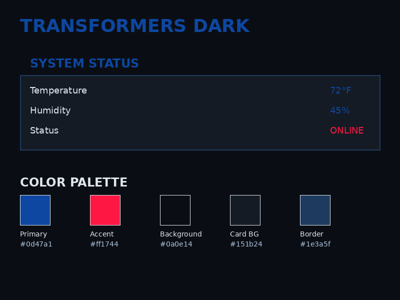
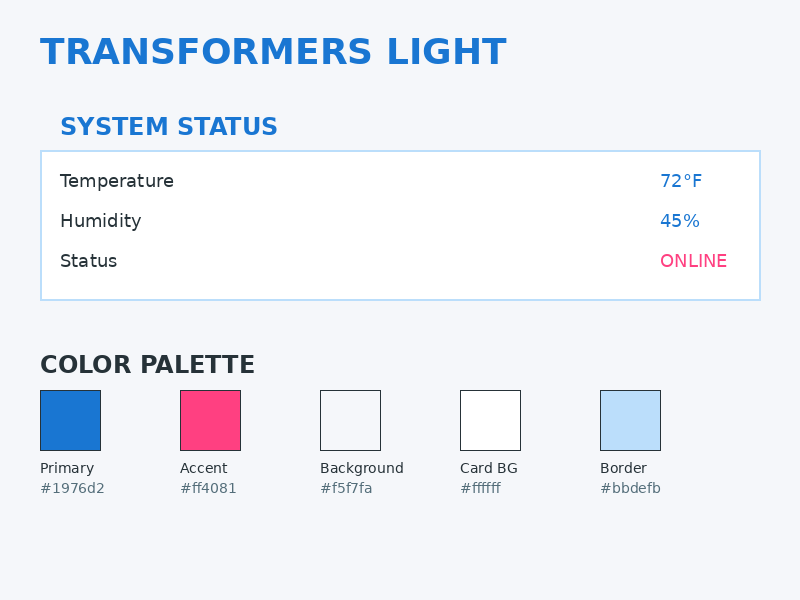
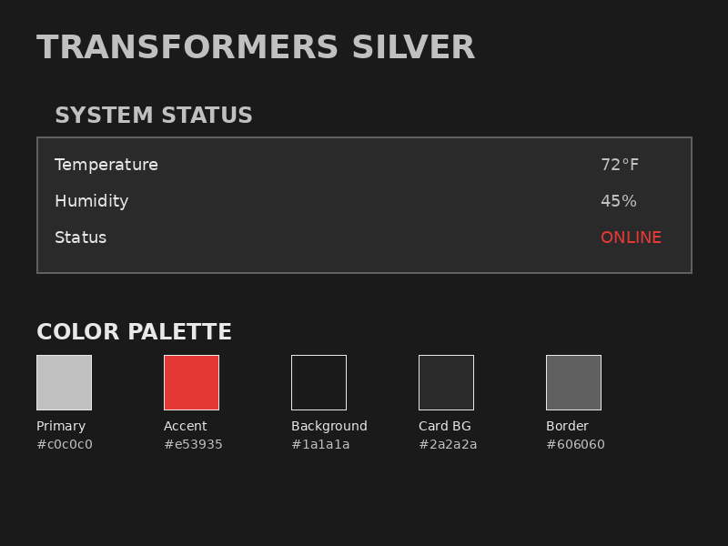
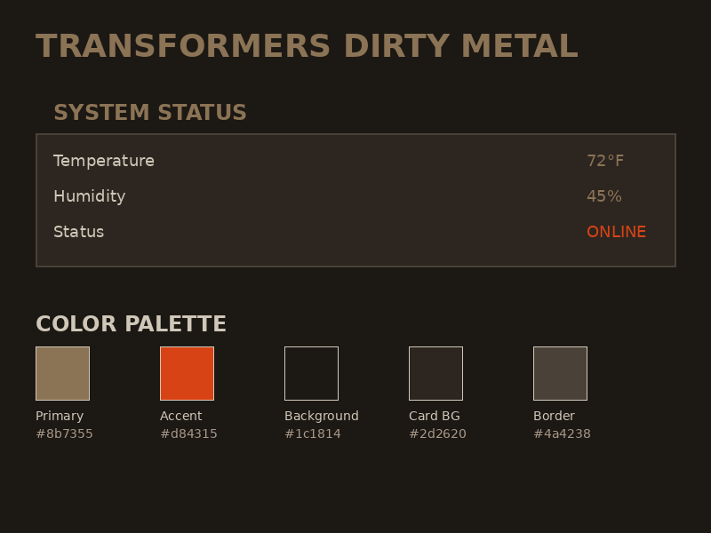

# Transformers Theme for Home Assistant

Transform your Home Assistant interface with the iconic aesthetic of the Transformers franchise. This theme collection brings the epic battles between Autobots and Decepticons to your smart home dashboard with four distinct visual styles.

## Overview

The Transformers Theme for Home Assistant offers four unique palettes inspired by different eras and styles of the Transformers franchise, from the classic G1 chrome aesthetic to the modern battle-worn metal look of the cinematic universe.

## Features

- 🤖 **Four Distinct Themes**: Dark, Light, Silver (Retro), and Dirty Metal (Modern)
- 🔤 **Authentic Typography**: Official Transformers Movie font for headers and titles
- 🎨 **Complete UI Coverage**: All Home Assistant elements themed consistently
- ✨ **Enhanced Visual Effects**: Metallic borders, glows, and shadows
- 🎯 **card-mod Integration**: Advanced styling for deep UI customization
- 📱 **Responsive Design**: Works perfectly on desktop and mobile
- 🚀 **Easy Installation**: Full HACS support

## Theme Variants

### 🌑 Transformers Dark
The default dark theme with Autobot-inspired blue accents and Decepticon red highlights. Perfect for nighttime viewing with a sleek, futuristic metallic interface.



**Colors:**
- Primary: Deep Blue (#0d47a1)
- Accent: Vibrant Red (#ff1744)
- Background: Dark Metallic (#0a0e14)

### ☀️ Transformers Light
A bright, clean theme inspired by the gleaming metal of Cybertron. Ideal for daytime use with excellent readability and energy-efficient for OLED displays.



**Colors:**
- Primary: Bright Blue (#1976d2)
- Accent: Pink Energy (#ff4081)
- Background: Light Metallic (#f5f7fa)

### 🪙 Transformers Silver
Retro chrome aesthetic inspired by the classic G1 Transformers logo and vintage toy packaging. Features metallic silver with chrome effects reminiscent of the 1980s era.



**Colors:**
- Primary: Chrome Silver (#c0c0c0)
- Accent: Classic Red (#e53935)
- Background: Dark Gunmetal (#1a1a1a)

**Special Effects:**
- Chrome text shadows
- Metallic gradients
- Vintage industrial look

### ⚙️ Transformers Dirty Metal
Modern battle-worn aesthetic from the recent Transformers films. Weathered, gritty metal with rust and copper accents for a realistic, lived-in feel.



**Colors:**
- Primary: Gunmetal (#8b7355)
- Accent: Rust Orange (#d84315)
- Background: Weathered Black (#1c1814)

**Special Effects:**
- Textured metal backgrounds
- Oxidized copper tones
- Battle-damage aesthetics

## Installation

### Prerequisites

**Required**: [card-mod](https://github.com/thomasloven/lovelace-card-mod) must be installed via HACS for full theme functionality.

1. Open HACS → Frontend
2. Search for "card-mod"
3. Install and restart Home Assistant

### HACS Installation (Recommended)

1. Open HACS in your Home Assistant instance
2. Go to "Frontend" section
3. Click the "+" button
4. Search for "Transformers Theme"
5. Click "Install"
6. Restart Home Assistant

### Manual Installation

1. Copy the `themes` folder to your Home Assistant configuration directory
2. Copy the `www` folder to your Home Assistant configuration directory
3. Add the following to your `configuration.yaml`:

```yaml
frontend:
  themes: !include_dir_merge_named themes
```

4. Restart Home Assistant

## Usage

### Applying to a View

The theme works best when applied to specific views (recommended):

1. Edit your dashboard
2. Click on a view (tab)
3. Click "Edit View"
4. Under "Theme", select your preferred variant:
   - `transformers-dark`
   - `transformers-light`
   - `transformers-silver`
   - `transformers-dirty-metal`
5. Save

### Setting as Profile Default

1. Go to your Home Assistant profile (click your username)
2. Under "Theme", select your preferred Transformers theme
3. The theme applies immediately

### Setting as System Default

To set as default for all users, add to `configuration.yaml`:

```yaml
frontend:
  themes: !include_dir_merge_named themes
  default_theme: transformers-dark
```

## Typography System

### Font Usage

The themes use a single, authentic font throughout:

| Element | Font | Purpose |
|---------|------|---------|
| **All Text** | Transformers Movie | Consistent iconic styling across the entire interface |

### Font Stack

- **Transformers Movie** - Authentic movie logo font used for all text elements

The font loads automatically via card-mod when the theme is applied.

## Visual Design

### Common Design Elements

**Metallic Borders:**
- 2px borders on all cards
- Glowing effects on active states
- Subtle rounded corners (except silver variant)

**Typography Effects:**
- Text shadows for depth
- Letter spacing for technical feel
- Uppercase headers for impact

**Icon System:**
- Theme-colored icons throughout
- Brighter colors for active states
- Consistent visual hierarchy

### Card Type Support

The themes include specialized styling for:

- ✅ **Heading Cards** - Large Transformers font titles
- ✅ **Markdown Cards** - Formatted content with proper hierarchy
- ✅ **Entities Cards** - Full typography hierarchy with separators
- ✅ **Button Cards** - Interactive hover effects
- ✅ **Gauge Cards** - Theme-appropriate visualizations
- ✅ **Graph Cards** - Color-matched plot lines
- ✅ More card types automatically inherit base styling

## Technical Details

### card-mod Integration

The themes use advanced card-mod features:

```yaml
card-mod-theme: transformers-dark
card-mod-view-yaml: |
  # View-level styling
card-mod-card-yaml: |
  # Universal card styling
card-mod-card-type-heading-yaml: |
  # Heading card specific
card-mod-card-type-entities-yaml: |
  # Entities card specific
```

Shadow DOM piercing ensures styling applies throughout Home Assistant components.

### Browser Compatibility

- **Chrome/Edge**: Full support
- **Firefox**: Full support
- **Safari**: Full support
- **Mobile**: Full support (responsive design)

### Performance

- Font loads from local files (no external dependencies)
- Minimal CSS overhead
- No JavaScript required
- Optimized for fast rendering

## Troubleshooting

### Theme Not Applied

1. Verify card-mod is installed via HACS
2. Restart Home Assistant after installation
3. Apply theme to view (not just profile)
4. Hard refresh browser (Ctrl+Shift+R / Cmd+Shift+R)

### Fonts Not Loading

1. Check that theme is applied to your view
2. Verify browser console (F12) for errors
3. Confirm `/local/transformers/fonts/` is accessible
4. Clear browser cache and reload

### Styling Issues

1. Reload themes: Developer Tools → YAML → Reload Themes
2. Confirm card-mod is loaded in Lovelace resources
3. Check for YAML syntax errors in theme files
4. Try different theme variant

## Compatibility

- **Home Assistant**: 2024.1.0 or newer
- **card-mod**: Required (latest version via HACS)
- **HACS**: Recommended for installation
- **Browsers**: All modern browsers with shadow DOM support

## Repository Structure

```
ha-transformers-theme/
├── themes/
│   └── transformers-themes.yaml     # Single file with all 4 theme variants
├── www/
│   └── transformers/
│       └── fonts/
│           ├── transformers-fonts.css
│           └── TransformersMovie-y9Ad.ttf
├── transformers-movie-font/
│   ├── TransformersMovie-y9Ad.ttf
│   └── info.txt
├── screenshots/
├── .github/
│   └── workflows/
│       └── validate.yaml
├── .gitignore
├── hacs.json
├── README.md
└── LICENSE
```

## Development

### Testing

Recommended test cards for development:

```yaml
- type: heading
  heading: "AUTOBOTS, ROLL OUT!"
- type: markdown
  content: |
    **CYBERTRON STATUS:** OPERATIONAL
    *Freedom is the right of all sentient beings.*
- type: entities
  title: "Energon Levels"
  entities:
    - sun.sun
    - sensor.time
- type: button
  entity: light.living_room
  name: "Matrix of Leadership"
```

### Contributing

Contributions welcome! Please:

1. Fork the repository
2. Create a feature branch
3. Make your changes
4. Test with multiple card types
5. Submit a pull request

## About Transformers

The Transformers franchise began in 1984 and has since become a global phenomenon spanning toys, animated series, films, comics, and video games. This theme celebrates the iconic visual style of the franchise, particularly the recognizable logo typography and metallic aesthetics.

## License

This project is licensed under the MIT License - see the [LICENSE](LICENSE) file for details.

### Font License

The Transformers Movie font is used under Freeware, Non-Commercial license from [FontSpace](https://www.fontspace.com/transformers-movie-font-f34560).

## Acknowledgments

- Inspired by the Transformers franchise
- Transformers Movie font from FontSpace
- Created for the Home Assistant community
- Built with [card-mod](https://github.com/thomasloven/lovelace-card-mod) for advanced styling

## Support

If you encounter any issues or have suggestions:
- [Open an issue](https://github.com/loryanstrant/ha-transformers-theme/issues) on GitHub
- Check existing issues for solutions
- Include Home Assistant version and browser details

---

**Note**: This is a fan-made theme inspired by the Transformers franchise. Not affiliated with or endorsed by Hasbro or Paramount Pictures.

**"Freedom is the right of all sentient beings."** - Optimus Prime
